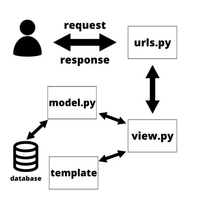
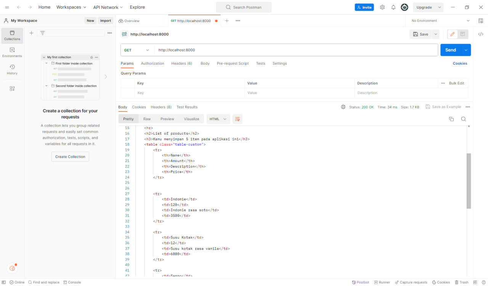
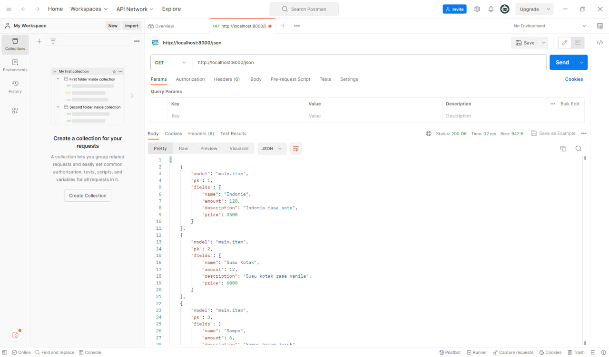
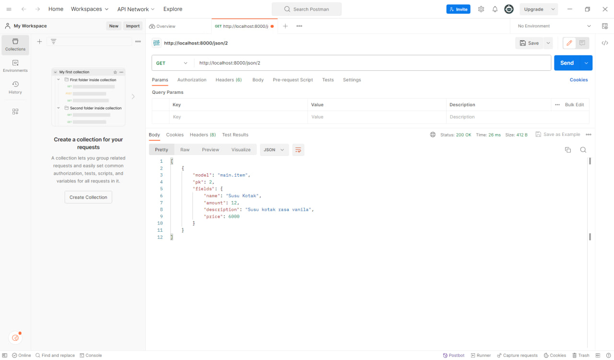
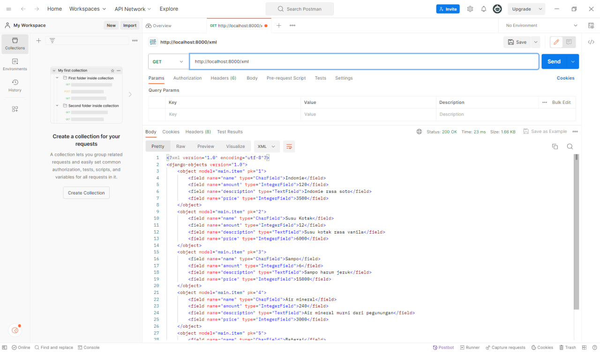
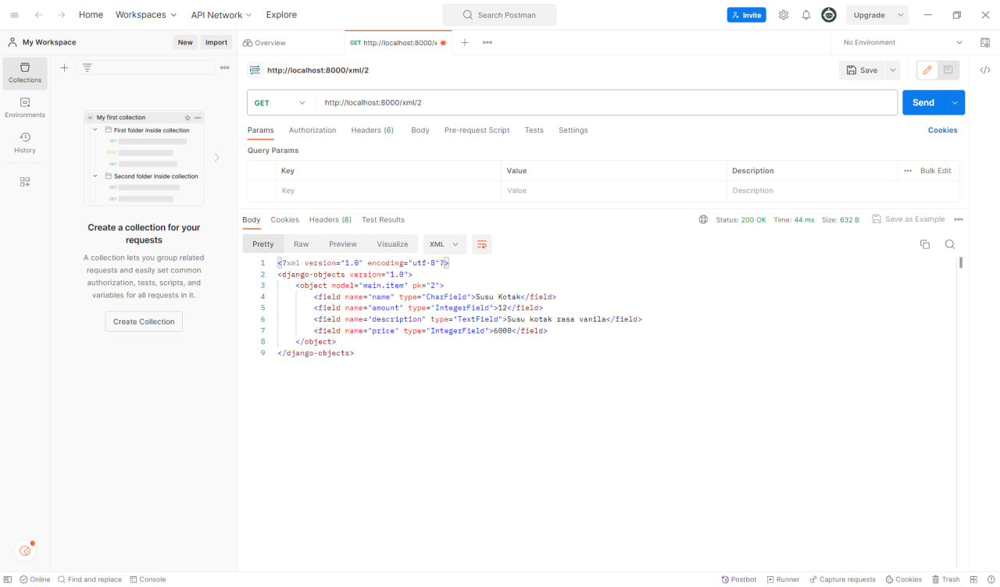

## DekatriaMart Warehouse

Link Deployment: https://dekatriamart-warehouse.adaptable.app/

<details>
<summary>Tugas 2</summary>

## Daftar Isi

1. [Proses Pengerjaan Tugas](#proses-pengerjaan-tugas)
2. [Bagan _Request Client_](#bagan-request-client)
3. [Penjelasan _Virtual Environment_](#penjelasan-virtual-environment)
4. [MVC, MVT, dan MVVM](#mvc-mvt-dan-mvvm)

## Proses Pengerjaan Tugas

1. Membuat direktori DekatriaMart-Warehouse
2. Membuat python virtual environment di dalam direktori tersebut kemudian mengaktifkannya
    - Buka direktori DekatriaMart-Warehouse di VS Code
    - Buka Command Palette (Ctrl+Shift+P)
    - Cari command Python: Create Environment lalu klik
    - Pilih Venv
    - Pilih versi Python terbaru lalu tunggu hingga proses pembuatan virtual environment selesai
    - Aktifkan virtual environment
        ```bash
        env\Scripts\activate
        ```
3. Membuat berkas `requirements.txt` yang berisikan dependencies yang diperlukan kemudian install seluruh dependencies tersebut.
    ```bash
    pip install -r requirements.txt
    ```
4. Inisiasi proyek django bernama `dekatriamart_warehouse`
    ```bash
    django-admin startproject dekatriamart_warehouse .
    ```
5. Menambahkan \* pada `ALLOWED_HOSTS` di `settings.py`
    ```bash
    ...
    ALLOWED_HOSTS = ["*"]
    ...
    ```
6. Membuat aplikasi baru bernama `main`
    ```bash
    python manage.py startapp main
    ```
7. Mendaftarkan aplikasi `main` ke `settings.py` di dalam direktori proyek `dekatriamart_warehouse`
    ```bash
    INSTALLED_APPS = [
    ...,
    'main',
    ...
    ]
    ```
8. Membuat model Item pada `models.py` pada direktori aplikasi `main`.
9. Melakukan migrasi model
    ```bash
    python manage.py makemigrations
    python manage.py migrate
    ```
10. Membuat direktori baru bernama `templates` di dalam direktori aplikasi `main` kemudian membuat berkas baru bernama `main.html`
11. Mengisi berkas `views.py` pada direktori aplikasi `main`
12. Mengisi berkas `urls.py` pada direktori aplikasi `main`
13. Mengisi berkas `urls.py` pada direktori proyek `DekatriaMart-Warehouse`
14. Membuat _testing_ dengan mengisi berkas `test.py` pada direktori aplikasi `main`
15. Menambahkan berkas `.gitignore`
16. Menambahkan berkas `README.md`
17. Membuat repositori baru di github bernama `DekatriaMart-Warehouse` dengan visibilitas "Public"
18. Menghubungkan Repositori Lokal dengan Repositori di GitHub
    ```bash
    git init
    git add .
    git commit -m "first commit"
    git branch -M main
    git remote add origin https://github.com/RobertBenyamin/DekatriaMart-Warehouse.git
    git push -u origin main
    ```
19. Mendeploy proyek ke Adaptable

## Bagan _Request Client_



1. Django menerima `HTTP Request`. Jika `HTTP Request` yang diterima sesuai dengan URL tertentu yang terdapat pada `urls.py`, maka `view function` (views.py) terkait akan dipanggil dan meneruskan permintaan tersebut.
2. `View` akan memproses permintaan sesuai dengan logika yang telah definisikan. Ini bisa mencakup mengambil data dari basis data (`models.py`), render template (`templates`), atau berbagai tindakan lainnya yang sesuai dengan kebutuhan aplikasi.
3. Setelah pemrosesan permintaan selesai, `view` akan mengembalikan sebuah respon. Respon ini bisa berupa halaman HTML, data JSON, atau tipe respon lainnya sesuai dengan jenis permintaan yang dibuat oleh client. Respon ini akan ditampilkan pada browser pengguna.

<small>
Sumber: <br>  
https://www.w3schools.com/django/django_intro.php <br>
https://developer.mozilla.org/en-US/docs/Learn/Server-side/Django/Introduction
</small>

## Penjelasan Virtual Environment

Virtual environment adalah alat yang membantu menjaga dependencies yang diperlukan oleh berbagai proyek terpisah satu sama lainnya dengan membuat lingkungan virtual yang terisolasi bagi setiap proyek.

Terdapat beberapa manfaat yang bisa kita dapatkan dengan menggunakan virtual environment, diantaranya adalah:

-   Environment yang stabil: <br>
    Virtual environment memungkinkan kita untuk membuat proyek dengan lingkungan yang terisolasi, sehingga tidak akan mengganggu sistem Python secara global atau lingkungan virtual lainnya. Ini berarti bahwa perubahan pada sistem atau proyek lain tidak akan mempengaruhi stabilitas proyek kita dan begitu pula sebaliknya.
-   Environment yang dapat direproduksi: <br>
    Kita dapat membuat daftar dependencies dan sub-dependencies dalam sebuah file, untuk proyek kita, yang memudahkan kita ataupun orang lain untuk mereplikasi dan menginstal semua dependencies yang digunakan dalam lingkungan kita pada sistem yang berbeda. Sehingga, dapat dipastikan bahwa proyek kita tetap berjalan secara konsisten terlepas dari lingkungan tempat proyek tersebut dijalankan.

Kita tetap dapat mengembangkan aplikasi tanpa menggunakan virtual environment, tetapi hal tersebut sangat tidak disarankan karena terdapat resiko terjadinya konflik versi dependencies.

<small>
Sumber: <br>  
https://www.geeksforgeeks.org/python-virtual-environment/ <br>
https://www.freecodecamp.org/news/how-to-setup-virtual-environments-in-python/ <br>
https://ngangasn.com/is-virtualenv-venv-necessary-for-django/
</small>

## MVC, MVT, dan MVVM

### Penjelasan

1. MVC
    - Model: Komponen Model berhubungan dengan semua logika terkait data yang diperlukan pengguna. Model berinteraksi dengan database dan memberikan data yang diperlukan kembali ke Controller.
    - View: Komponen View menghasilkan User Interface untuk pengguna. Tampilan dibuat oleh data yang dikumpulkan oleh komponen model tetapi data ini tidak diambil secara langsung, tetapi melalui controller.
    - Controller: Komponen ini menghubungkan View dan Model. Komponen ini memproses semua logika aplikasi dan request yang masuk, memanipulasi data menggunakan komponen Model, dan berinteraksi dengan komponen View untuk merender tampilan akhir.
2. MVT
    - Model: Komponen Model bertanggung jawab untuk mengatur dan mengelola data dari aplikasi. Model menghubungkan aplikasi dengan basis data dan mengatur interaksi dengan data tersebut.
    - View: Komponen View berperan sebagai pengatur tampilan dan mengambil data dari model untuk disajikan kepada pengguna.
    - Template: Komponen Template berfungsi untuk merancang tampilan atau antarmuka pengguna yang akhirnya akan diisi dengan data dari Model melalui view.
3. MVVM
    - Model: Komponen Model bertanggung jawab untuk abstraksi sumber data. Model dan ViewModel bekerja bersama untuk mendapatkan dan menyimpan data.
    - View: Komponen View berisi UI dari aplikasi untuk mengatur bagaimana informasi akan ditampilkan.
    - ViewModel: Komponen ViewModel bertugas untuk berinteraksi dengan Model di mana data yang ada akan diteruskan ke View.

### Perbedaan

MVC | MVT  | MVVM
:---: | :---: | :---: 
Model mengirim pembaruan ke View melalui Controller. Controller mengatur logika aplikasi. | Model mengirim data ke Template yang kemudian menghasilkan tampilan HTML.  | ViewModel mengonversi data dari Model menjadi format yang dapat ditampilkan oleh View. View dapat mengirim tindakan pengguna kembali ke ViewModel.
Input user ditangani oleh Controller | Input user ditangani oleh View  | Input user ditangani oleh View
UI terdapat pada View | UI terdapat pada Template | UI terdapat pada View
Cocok untuk proyek skala besar | Cocok untuk proyek skala besar ataupun kecil  | Cocok untuk proyek skala besar
Umum digunakan dalam pengembangan aplikasi desktop, aplikasi web tradisional. | Digunakan dalam pengembangan web dengan framework Django (Python).  | Populer dalam pengembangan aplikasi dengan teknologi seperti Angular, Vue.js, Xamarin, dan WPF.                          |

</details>

<details>
<summary>Tugas 3</summary>

## Daftar Isi

1. [Proses Pengerjaan Tugas](#proses-pengerjaan-tugas-1)
2. [Perbedaan antara form POST dan form GET dalam Django](#perbedaan-antara-form-post-dan-form-get-dalam-django)
3. [Perbedaan Utama antara XML, JSON, dan HTML dalam Konteks Pengiriman Data](#perbedaan-utama-antara-xml-json-dan-html-dalam-konteks-pengiriman-data)
4. [Alasan JSON sering Digunakan dalam Pertukaran Data antara Aplikasi Web Modern](#alasan-json-sering-digunakan-dalam-pertukaran-data-antara-aplikasi-web-modern)
5. [Screenshot Postman](#screenshot-postman)

## Proses Pengerjaan Tugas

1. Membuat direktori `templates` pada _root folder_ kemudian membuat `base.html` pada direktori tersebut
2. Menambahkan kode di bawah pada `TEMPLATES` di `settings.py` yang ada pada subdirektori `dekatriamart_warehouse`
    ```java
    ...
    'DIRS': [BASE_DIR / 'templates'],
    ...
    ```
3. Membuat berkas `forms.py` pada direktori `main` yang berisikan class `ItemForm` yang berfungsi sebagai form untuk menambahkan Item.
4. Membuat fungsi `create_item` pada `views.py` yang berfungsi untuk menangani logika ketika user menambahkan `Item`
5. Update fungsi `home` pada `views.py` agar dapat mengirimkan data `Item` ke `main.html`
6. Membuat berkas `create_item.html` pada subdirektori `templates` yang ada pada direktori `main` dan mengisinya dengan kode untuk menampilkan _form add item_
7. Update `main.html` yang ada pada subdirektori `templates` yang ada pada direktori `main` agar dapat menampilkan seluruh `Item` yang tersimpan
8. Membuat fungsi `show_xml`, `show_json`, `show_xml_by_id`, dan `show_json_by_id` pada `views.py` yang berfungsi seperti API untuk mengembalikan data dalam bentuk XML atau JSON.
9. Menambahkan _path url_ dari semua fungsi yang baru ditambahkan ke dalam `urlpatterns` pada `urls.py` yang ada pada direktori `main`
10. Membuat direktori `styles` pada _root folder_ kemudian membuat `main.css` pada direktori tersebut yang berisikan _styling_ untuk tabel Item pada `main.html`
11. Menambahkan kode berikut pada `base.html` yang terdapat pada direktori `templates` yang ada pada _root folder_ agar _styling_ terimplementasi
    ```html
    ...
    <link rel="stylesheet" href="" />
    ...
    ```
12. Menambahkan kode berikut pada `main.html` yang terdapat pada subdirektori `templates` yang ada pada direktori `main` untuk menampilkan pesan "Kamu menyimpan X item pada aplikasi ini"
    ```html
    ...
    <h3>Kamu menyimpan {{items.count}} item pada aplikasi ini</h3>
    ...
    ```

## Perbedaan antara form POST dan form GET dalam Django

- Form GET akan menampilkan hasil input user pada url, sehingga membuat form GET memiliki tingkat keamanan yang rendah. Form GET juga tidak bisa memodifikasi data yang diambil dari input user sebelum disimpan.
- Form POST tidak akan menampilkan hasil input user pada url, sehingga membuat form POST memiliki tingkat keamanan yang lebih tinggi. Form POST dapat memodifikasi input user sebelum akhirnya disimpan di database.

<small>
Sumber: <br>  
https://docs.djangoproject.com/en/4.2/topics/forms/#get-and-post <br>
https://www.geeksforgeeks.org/render-html-forms-get-post-in-django/
</small>

## Perbedaan Utama antara XML, JSON, dan HTML dalam Konteks Pengiriman Data

- XML (Extensible Markup Language) adalah *markup language* dan format file untuk menyimpan, mentransmisikan, dan merekonstruksi data. XML menggunakan struktur tag untuk merepresentasikan data. Hal tersebut menyebabkan struktur XML lebih kompleks untuk dibaca dan ditulis. XML mendukung banyak tipe data, seperti strings, numbers, booleans, gambar, namespaces, dll.
Contoh XML:
    ```
    <?xml version="1.0" encoding="UTF-8" ?>
    <root>
        <student>
            <id>01</id>
            <name>Tom</name>
            <lastname>Price</lastname>
        </student>
        <student>
            <id>02</id>
            <name>Nick</name>
            <lastname>Thameson</lastname>
        </student>
    </root>
    ```
- JSON (JavaScript Object Notation) adalah format file yang menggunakan teks yang mudah dibaca manusia untuk menyimpan dan mengirimkan objek data yang berisi pasangan *attribute-value*. JSON mendukung tipe data, seperti strings, numbers, booleans, null, arrays, dan objects. 
Contoh JSON:
    ```
    {
        "student": [ 
            
            { 
                "id":"01", 
                "name": "Tom", 
                "lastname": "Price" 
            }, 
            
            { 
                "id":"02", 
                "name": "Nick", 
                "lastname": "Thameson" 
            } 
        ]   
    }
    ```
- HTML
    Berbeda dengan XML dan JSON, HTML tidak berfungsi sebagai alat untuk transfer data. HTML adalah *markup language* untuk membuat halaman Web. 

<small>
Sumber: <br>  
https://www.deltaxml.com/blog/xml/whats-the-relationship-between-xml-json-html-and-the-internet/ <br>
https://aws.amazon.com/compare/the-difference-between-json-xml/ <br>
https://www.guru99.com/json-vs-xml-difference.html
</small>

## Alasan JSON sering Digunakan dalam Pertukaran Data antara Aplikasi Web Modern

- JSON sering digunakan dalam pertukaran data karena syntax JSON yang disusun atas pasangan *key* dan *value* jauh lebih mudah dibaca dan dipahami, dibandingkan XML yang menggunakan *tag*. 
- JSON mendukung banyak tipe data, seperti strings, numbers, booleans, null, arrays, dan objects. 
- JSON didukung oleh banyak browser modern, server web, dan API web, sehingga semakin memudahkan pertukaran data di berbagai sistem dan lingkungan.
- dan masih banyak lagi

<small>
Sumber: <br>  
https://www.linkedin.com/advice/3/what-benefits-drawbacks-using-json-data
</small>

## Screenshot Postman
- HTML Response
    
- JSON Response
    
- JSON Response by ID
    
- XML Response
    
- XML Response by ID
    

</details>
