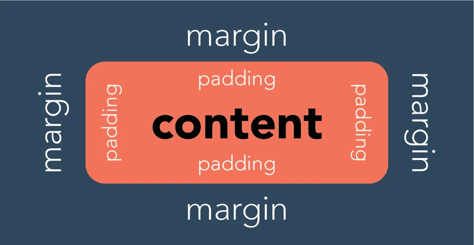

## DekatriaMart Warehouse

Link Deployment: https://dekatriamart-warehouse.adaptable.app/

<details>
<summary>Tugas 2</summary>

## Daftar Isi

1. [Proses Pengerjaan Tugas](#proses-pengerjaan-tugas)
2. [Bagan _Request Client_](#bagan-request-client)
3. [Penjelasan _Virtual Environment_](#penjelasan-virtual-environment)
4. [MVC, MVT, dan MVVM](#mvc-mvt-dan-mvvm)

## Proses Pengerjaan Tugas

1. Membuat direktori DekatriaMart-Warehouse
2. Membuat python virtual environment di dalam direktori tersebut kemudian mengaktifkannya
    - Buka direktori DekatriaMart-Warehouse di VS Code
    - Buka Command Palette (Ctrl+Shift+P)
    - Cari command Python: Create Environment lalu klik
    - Pilih Venv
    - Pilih versi Python terbaru lalu tunggu hingga proses pembuatan virtual environment selesai
    - Aktifkan virtual environment
        ```bash
        env\Scripts\activate
        ```
3. Membuat berkas `requirements.txt` yang berisikan dependencies yang diperlukan kemudian install seluruh dependencies tersebut.
    ```bash
    pip install -r requirements.txt
    ```
4. Inisiasi proyek django bernama `dekatriamart_warehouse`
    ```bash
    django-admin startproject dekatriamart_warehouse .
    ```
5. Menambahkan \* pada `ALLOWED_HOSTS` di `settings.py`
    ```bash
    ...
    ALLOWED_HOSTS = ["*"]
    ...
    ```
6. Membuat aplikasi baru bernama `main`
    ```bash
    python manage.py startapp main
    ```
7. Mendaftarkan aplikasi `main` ke `settings.py` di dalam direktori proyek `dekatriamart_warehouse`
    ```bash
    INSTALLED_APPS = [
    ...,
    'main',
    ...
    ]
    ```
8. Membuat model Item pada `models.py` pada direktori aplikasi `main`.
9. Melakukan migrasi model
    ```bash
    python manage.py makemigrations
    python manage.py migrate
    ```
10. Membuat direktori baru bernama `templates` di dalam direktori aplikasi `main` kemudian membuat berkas baru bernama `main.html`
11. Mengisi berkas `views.py` pada direktori aplikasi `main`
12. Mengisi berkas `urls.py` pada direktori aplikasi `main`
13. Mengisi berkas `urls.py` pada direktori proyek `DekatriaMart-Warehouse`
14. Membuat _testing_ dengan mengisi berkas `test.py` pada direktori aplikasi `main`
15. Menambahkan berkas `.gitignore`
16. Menambahkan berkas `README.md`
17. Membuat repositori baru di github bernama `DekatriaMart-Warehouse` dengan visibilitas "Public"
18. Menghubungkan Repositori Lokal dengan Repositori di GitHub
    ```bash
    git init
    git add .
    git commit -m "first commit"
    git branch -M main
    git remote add origin https://github.com/RobertBenyamin/DekatriaMart-Warehouse.git
    git push -u origin main
    ```
19. Mendeploy proyek ke Adaptable

## Bagan _Request Client_


1. Django menerima `HTTP Request`. Jika `HTTP Request` yang diterima sesuai dengan URL tertentu yang terdapat pada `urls.py`, maka `view function` (views.py) terkait akan dipanggil dan meneruskan permintaan tersebut.
2. `View` akan memproses permintaan sesuai dengan logika yang telah definisikan. Ini bisa mencakup mengambil data dari basis data (`models.py`), render template (`templates`), atau berbagai tindakan lainnya yang sesuai dengan kebutuhan aplikasi.
3. Setelah pemrosesan permintaan selesai, `view` akan mengembalikan sebuah respon. Respon ini bisa berupa halaman HTML, data JSON, atau tipe respon lainnya sesuai dengan jenis permintaan yang dibuat oleh client. Respon ini akan ditampilkan pada browser pengguna.

<small>
Sumber: <br>  
https://www.w3schools.com/django/django_intro.php <br>
https://developer.mozilla.org/en-US/docs/Learn/Server-side/Django/Introduction
</small>

## Penjelasan Virtual Environment

Virtual environment adalah alat yang membantu menjaga dependencies yang diperlukan oleh berbagai proyek terpisah satu sama lainnya dengan membuat lingkungan virtual yang terisolasi bagi setiap proyek.

Terdapat beberapa manfaat yang bisa kita dapatkan dengan menggunakan virtual environment, diantaranya adalah:

-   Environment yang stabil: <br>
    Virtual environment memungkinkan kita untuk membuat proyek dengan lingkungan yang terisolasi, sehingga tidak akan mengganggu sistem Python secara global atau lingkungan virtual lainnya. Ini berarti bahwa perubahan pada sistem atau proyek lain tidak akan mempengaruhi stabilitas proyek kita dan begitu pula sebaliknya.
-   Environment yang dapat direproduksi: <br>
    Kita dapat membuat daftar dependencies dan sub-dependencies dalam sebuah file, untuk proyek kita, yang memudahkan kita ataupun orang lain untuk mereplikasi dan menginstal semua dependencies yang digunakan dalam lingkungan kita pada sistem yang berbeda. Sehingga, dapat dipastikan bahwa proyek kita tetap berjalan secara konsisten terlepas dari lingkungan tempat proyek tersebut dijalankan.

Kita tetap dapat mengembangkan aplikasi tanpa menggunakan virtual environment, tetapi hal tersebut sangat tidak disarankan karena terdapat resiko terjadinya konflik versi dependencies.

<small>
Sumber: <br>  
https://www.geeksforgeeks.org/python-virtual-environment/ <br>
https://www.freecodecamp.org/news/how-to-setup-virtual-environments-in-python/ <br>
https://ngangasn.com/is-virtualenv-venv-necessary-for-django/
</small>

## MVC, MVT, dan MVVM

### Penjelasan

1. MVC
    - Model: Komponen Model berhubungan dengan semua logika terkait data yang diperlukan pengguna. Model berinteraksi dengan database dan memberikan data yang diperlukan kembali ke Controller.
    - View: Komponen View menghasilkan User Interface untuk pengguna. Tampilan dibuat oleh data yang dikumpulkan oleh komponen model tetapi data ini tidak diambil secara langsung, tetapi melalui controller.
    - Controller: Komponen ini menghubungkan View dan Model. Komponen ini memproses semua logika aplikasi dan request yang masuk, memanipulasi data menggunakan komponen Model, dan berinteraksi dengan komponen View untuk merender tampilan akhir.
2. MVT
    - Model: Komponen Model bertanggung jawab untuk mengatur dan mengelola data dari aplikasi. Model menghubungkan aplikasi dengan basis data dan mengatur interaksi dengan data tersebut.
    - View: Komponen View berperan sebagai pengatur tampilan dan mengambil data dari model untuk disajikan kepada pengguna.
    - Template: Komponen Template berfungsi untuk merancang tampilan atau antarmuka pengguna yang akhirnya akan diisi dengan data dari Model melalui view.
3. MVVM
    - Model: Komponen Model bertanggung jawab untuk abstraksi sumber data. Model dan ViewModel bekerja bersama untuk mendapatkan dan menyimpan data.
    - View: Komponen View berisi UI dari aplikasi untuk mengatur bagaimana informasi akan ditampilkan.
    - ViewModel: Komponen ViewModel bertugas untuk berinteraksi dengan Model di mana data yang ada akan diteruskan ke View.

### Perbedaan

MVC | MVT  | MVVM
:---: | :---: | :---: 
Model mengirim pembaruan ke View melalui Controller. Controller mengatur logika aplikasi. | Model mengirim data ke Template yang kemudian menghasilkan tampilan HTML.  | ViewModel mengonversi data dari Model menjadi format yang dapat ditampilkan oleh View. View dapat mengirim tindakan pengguna kembali ke ViewModel.
Input user ditangani oleh Controller | Input user ditangani oleh View  | Input user ditangani oleh View
UI terdapat pada View | UI terdapat pada Template | UI terdapat pada View
Cocok untuk proyek skala besar | Cocok untuk proyek skala besar ataupun kecil  | Cocok untuk proyek skala besar
Umum digunakan dalam pengembangan aplikasi desktop, aplikasi web tradisional. | Digunakan dalam pengembangan web dengan framework Django (Python).  | Populer dalam pengembangan aplikasi dengan teknologi seperti Angular, Vue.js, Xamarin, dan WPF.                          |

</details>

<details>
<summary>Tugas 3</summary>

## Daftar Isi

1. [Proses Pengerjaan Tugas](#proses-pengerjaan-tugas-1)
2. [Perbedaan antara form POST dan form GET dalam Django](#perbedaan-antara-form-post-dan-form-get-dalam-django)
3. [Perbedaan Utama antara XML, JSON, dan HTML dalam Konteks Pengiriman Data](#perbedaan-utama-antara-xml-json-dan-html-dalam-konteks-pengiriman-data)
4. [Alasan JSON sering Digunakan dalam Pertukaran Data antara Aplikasi Web Modern](#alasan-json-sering-digunakan-dalam-pertukaran-data-antara-aplikasi-web-modern)
5. [Screenshot Postman](#screenshot-postman)

## Proses Pengerjaan Tugas

1. Membuat direktori `templates` pada _root folder_ kemudian membuat `base.html` pada direktori tersebut
2. Menambahkan kode di bawah pada `TEMPLATES` di `settings.py` yang ada pada subdirektori `dekatriamart_warehouse`
    ```java
    ...
    'DIRS': [BASE_DIR / 'templates'],
    ...
    ```
3. Membuat berkas `forms.py` pada direktori `main` yang berisikan class `ItemForm` yang berfungsi sebagai form untuk menambahkan Item.
4. Membuat fungsi `create_item` pada `views.py` yang berfungsi untuk menangani logika ketika user menambahkan `Item`
5. Update fungsi `home` pada `views.py` agar dapat mengirimkan data `Item` ke `main.html`
6. Membuat berkas `create_item.html` pada subdirektori `templates` yang ada pada direktori `main` dan mengisinya dengan kode untuk menampilkan _form add item_
7. Update `main.html` yang ada pada subdirektori `templates` yang ada pada direktori `main` agar dapat menampilkan seluruh `Item` yang tersimpan
8. Membuat fungsi `show_xml`, `show_json`, `show_xml_by_id`, dan `show_json_by_id` pada `views.py` yang berfungsi seperti API untuk mengembalikan data dalam bentuk XML atau JSON.
9. Menambahkan _path url_ dari semua fungsi yang baru ditambahkan ke dalam `urlpatterns` pada `urls.py` yang ada pada direktori `main`
10. Membuat direktori `styles` pada _root folder_ kemudian membuat `main.css` pada direktori tersebut yang berisikan _styling_ untuk tabel Item pada `main.html`
11. Menambahkan kode berikut pada `base.html` yang terdapat pada direktori `templates` yang ada pada _root folder_ agar _styling_ terimplementasi
    ```html
    ...
    <link rel="stylesheet" href="" />
    ...
    ```
12. Menambahkan kode berikut pada `main.html` yang terdapat pada subdirektori `templates` yang ada pada direktori `main` untuk menampilkan pesan "Kamu menyimpan X item pada aplikasi ini"
    ```html
    ...
    <h3>Kamu menyimpan {{items.count}} item pada aplikasi ini</h3>
    ...
    ```

## Perbedaan antara form POST dan form GET dalam Django

- Form GET akan menampilkan hasil input user pada url, sehingga membuat form GET memiliki tingkat keamanan yang rendah. Form GET juga tidak bisa memodifikasi data yang diambil dari input user sebelum disimpan.
- Form POST tidak akan menampilkan hasil input user pada url, sehingga membuat form POST memiliki tingkat keamanan yang lebih tinggi. Form POST dapat memodifikasi input user sebelum akhirnya disimpan di database.

<small>
Sumber: <br>  
https://docs.djangoproject.com/en/4.2/topics/forms/#get-and-post <br>
https://www.geeksforgeeks.org/render-html-forms-get-post-in-django/
</small>

## Perbedaan Utama antara XML, JSON, dan HTML dalam Konteks Pengiriman Data

- XML (Extensible Markup Language) adalah *markup language* dan format file untuk menyimpan, mentransmisikan, dan merekonstruksi data. XML menggunakan struktur tag untuk merepresentasikan data. Hal tersebut menyebabkan struktur XML lebih kompleks untuk dibaca dan ditulis. XML mendukung banyak tipe data, seperti strings, numbers, booleans, gambar, namespaces, dll.
Contoh XML:
    ```
    <?xml version="1.0" encoding="UTF-8" ?>
    <root>
        <student>
            <id>01</id>
            <name>Tom</name>
            <lastname>Price</lastname>
        </student>
        <student>
            <id>02</id>
            <name>Nick</name>
            <lastname>Thameson</lastname>
        </student>
    </root>
    ```
- JSON (JavaScript Object Notation) adalah format file yang menggunakan teks yang mudah dibaca manusia untuk menyimpan dan mengirimkan objek data yang berisi pasangan *attribute-value*. JSON mendukung tipe data, seperti strings, numbers, booleans, null, arrays, dan objects. 
Contoh JSON:
    ```
    {
        "student": [ 
            
            { 
                "id":"01", 
                "name": "Tom", 
                "lastname": "Price" 
            }, 
            
            { 
                "id":"02", 
                "name": "Nick", 
                "lastname": "Thameson" 
            } 
        ]   
    }
    ```
- HTML
    Berbeda dengan XML dan JSON, HTML tidak berfungsi sebagai alat untuk transfer data. HTML adalah *markup language* untuk membuat halaman Web. 

<small>
Sumber: <br>  
https://www.deltaxml.com/blog/xml/whats-the-relationship-between-xml-json-html-and-the-internet/ <br>
https://aws.amazon.com/compare/the-difference-between-json-xml/ <br>
https://www.guru99.com/json-vs-xml-difference.html
</small>

## Alasan JSON sering Digunakan dalam Pertukaran Data antara Aplikasi Web Modern

- JSON sering digunakan dalam pertukaran data karena syntax JSON yang disusun atas pasangan *key* dan *value* jauh lebih mudah dibaca dan dipahami, dibandingkan XML yang menggunakan *tag*. 
- JSON mendukung banyak tipe data, seperti strings, numbers, booleans, null, arrays, dan objects. 
- JSON didukung oleh banyak browser modern, server web, dan API web, sehingga semakin memudahkan pertukaran data di berbagai sistem dan lingkungan.
- dan masih banyak lagi

<small>
Sumber: <br>  
https://www.linkedin.com/advice/3/what-benefits-drawbacks-using-json-data
</small>

## Screenshot Postman
- HTML Response
    
- JSON Response
    
- JSON Response by ID
    
- XML Response
    
- XML Response by ID
    

</details>

<details>
<summary>Tugas 4</summary>

## Daftar Isi

1. [Proses Pengerjaan Tugas](#proses-pengerjaan-tugas-2)
2. [Pengertian, Kelebihan, dan Kekurangan Django UserCreationForm](#pengertian-kelebihan-dan-kekurangan-django-usercreationform)
3. [Perbedaan antara Autentikasi dan Otorisasi dalam Konteks Django](#perbedaan-antara-autentikasi-dan-otorisasi-dalam-konteks-django)
4. [Pengertian *Cookies* dalam Konteks Aplikasi Web dan Implementasinya pada Django](#pengertian-cookies-dalam-konteks-aplikasi-web-dan-implementasinya-pada-django)
5. [Risiko Penggunaan *Cookies* secara Default dalam Pengembangan Web](#risiko-penggunaan-cookies-secara-default-dalam-pengembangan-web)

## Proses Pengerjaan Tugas

1. Membuat kustomisasi model `User` pada `models.py`
    ```python
    ...
    from django.contrib.auth.models import AbstractUser

    class User(AbstractUser):
        ...
    ```
2. Menghubungkan model `User` dengan model `Item`
    ```python
    class Item(models.Model):
        user = models.ForeignKey(User, on_delete=models.CASCADE)
        ...
    ```
3. Membuat form registrasi user pada `forms.py`
    ```python
    ...
    from django.contrib.auth.forms import UserCreationForm

    class UserRegisterForm(UserCreationForm):
        class Meta:
            model = User
            fields = ["name", "username", "email", "warehouse_location"]
    ...
    ```
4. Membuat fungsi `register`, `login_user`, dan `logout_user` pada `views.py`
5. Menambahkan *path url* dari semua fungsi yang baru ditambahkan ke dalam `urlpatterns` pada `urls.py` yang ada pada direktori `main`
6. Membuat berkas `register.html` pada subdirektori `templates` yang ada pada direktori `main` dan mengisinya dengan kode untuk registrasi user
7. Membuat berkas `login.html` pada subdirektori `templates` yang ada pada direktori `main` dan mengisinya dengan kode untuk login user
8. Menggunakan data dari *cookies* untuk mengimpelemntasikan `last login`
9. Update `main.html` yang ada pada subdirektori `templates` yang ada pada direktori `main` agar dapat menampilkan informasi `last login`
10. Update fungsi `home`, `login_user`, dan `logout_user` pada `views.py` agar dapat menampilkan informasi `last login`
11. Menambahkan tombol menambahkan dan mengurangi `item amount` serta tombol menghapus `item` pada berkas `main.html`
12. Membuat berkas `delete_item.html` pada subdirektori `templates` yang ada pada direktori `main` dan mengisinya dengan kode untuk konfirmasi penghapusan `item`
13. Membuat fungsi `increase_amount`, `decrease_amount`, dan `delete_item` pada `views.py`
14. Menambahkan *path url* dari semua fungsi yang baru ditambahkan ke dalam `urlpatterns` pada `urls.py` yang ada pada direktori `main`
15. Merestriksi akses ke halaman `home`, `create_item`, dan `delete_item` dengan menambahkan kode berikut pada `views.py` di atas fungsi-fungsi tersebut.
    ```python
    ...
    from django.contrib.auth.decorators import login_required

    @login_required(login_url='/login')
    def home(request):
        ...
    ...
    ```

## Pengertian, Kelebihan, dan Kekurangan Django UserCreationForm

Django UserCreationForm adalah sebuah *built-in function* yang disediakan oleh Django. Form ini berfungsi untuk mendaftarkan user baru. Untuk menggunakan UserCreationForm, kita perlu mengimpornya dari django.contrib.auth.forms.
```python
from django.contrib.auth.forms import UserCreationForm  
```

Kelebihan:  
1. Mudah digunakan  
2. Menyediakan *field* bawaan  
3. Sudah termasuk kode html untuk menampilkannya di *front-end*  
4. Terintegrasi dengan sistem autentikasi Django  

Kekurangan:  
1. Fitur terbatas  
2. Memerlukan usaha ekstra untuk mengkustomisasi tampilan form  

<small>
Sumber: <br>
https://www.doprax.com/tutorial/django-tutorial-for-beginners-step-by-step-part-8-user-authentication-django/ <br>
https://www.javatpoint.com/django-usercreationform
</small>

## Perbedaan antara Autentikasi dan Otorisasi dalam Konteks Django

Autentikasi adalah proses memverifikasi identitas pengguna, yaitu memastikan bahwa pengguna yang mencoba mengakses sistem sesuai dengan identitas yang diberikan. 
Contoh: seorang pengguna diwajibkan untuk memasukkan username dan password untuk bisa mengakses web.

Otorisasi adalah proses menentukan apa yang pengguna terautentikasi boleh dan tidak boleh lakukan.
Contoh: seorang dengan role dosen dapat menambahkan mata kuliah, namun role mahasiswa tidak.

Kedua fitur tersebut sangat penting untuk memastikan keamanan sistem. Autentikasi dan otorisasi memastikan bahwa hanya pengguna yang berhak saja yang dapat mengakses fitur atau data tertentu.

<small>
Sumber: <br>
https://docs.djangoproject.com/en/4.2/topics/auth/
</small>

## Pengertian *Cookies* dalam Konteks Aplikasi Web dan  untuk mengimpelemntasikan `last login`

*Cookie* adalah file kecil yang disimpan di komputer pengguna. *Cookie* digunakan untuk menyimpan sejumlah data mengenai interaksi pengguna dengan website tertentu yang kemudian dapat diakses oleh server web atau komputer pengguna. *Cookie* dapat berisi semua jenis informasi seperti waktu terakhir mengunjungi situs web, item yang ditambahkan ke dalam keranjang belanja, preferensi bahasa, dan lain-lain.

Salah satu kegunaan pada Django adalah untuk mengelola data sesi pengguna. Sesi adalah cara untuk menyimpan informasi tentang pengguna di sisi server. Informasi tersebut kemudian akan digunakan dalam permintaan berikutnya. Django menggunakan *cookie* yang disebut `session id` untuk menyimpan *identifier* unik untuk setiap sesi pengguna. *Identifier* ini digunakan untuk mengambil data sesi pengguna dari basis data Django.

1. Saat pengguna login, sebuah sesi dibuat dengan ID sesi yang unik (session ID). ID sesi akan dikirim ke browser pengguna.
2. Server kemudian akan membuat variabel sesi `auth_user` dan menyimpan di dalamnya informasi dari pengguna yang login. Data sesi akan disimpan dalam sebuah file di sisi server. Nama file tersebut adalah `session ID`.
3. Ketika pengguna meminta halaman dashboard, browser akan mengirimkan *cookie* yang berisi ID sesi bersamaan dengan permintaan tersebut.
4. Server menerima permintaan yang masuk, mengambil ID sesi, dan mencari sesi terkait. Setelah sesi ditemukan, server akan mengambil data.
5. Terakhir, server perlu memeriksa keberadaan variabel sesi `auth_user` tersebut. Jika ditemukan, server akan memberikan akses ke halaman dashboard.

<small>
Sumber: <br>
https://www.geeksforgeeks.org/cookies-used-website/ <br>
https://medium.com/@hendelRamzy/how-session-and-cookies-works-640fb3f349d1
</small>

## Risiko Penggunaan *Cookies* secara Default dalam Pengembangan Web

Meskipun *cookie* memiliki banyak kegunaan, *cookies* memiliki banyak risiko yang harus diwaspadai.
1. Cross-Site Request Forgery (CSRF): CSRF adalah serangan di mana penyerang memaksa pengguna yang terautentikasi untuk melakukan tindakan yang tidak diinginkan tanpa sepengetahuan mereka. *Cookies* dapat digunakan dalam serangan ini untuk menyampaikan permintaan palsu ke server dengan otentikasi pengguna yang sah.
2. Session Fixation:  Pada jenis serangan ini, penyerang mencoba memanipulasi atau menetapkan ID sesi pengguna sehingga pengguna nantinya akan menggunakan sesi yang telah dimanipulasi tersebut. Dengan menggunakan metode ini, penyerang dapat membuat pengguna untuk login sebagai penyerang pada berbagai tingkat aplikasi.
3. Cross-Site Scripting (XSS): XSS adalah serangan di mana penyerang memasukkan script berbahaya ke dalam situs web. Pengguna yang mengakses web tersebut kemudian akan menerima dan menjalankan script berbahaya yang telah ditanam. Script berbahaya tersebut kemudian dapat mengakses *cookie*, ID sesi, atau informasi sensitif lainnya yang disimpan oleh browser dan digunakan pada web tersebut.
4. dll

Beberapa hal yang dapat dilakukan untuk mencegah risiko tersebut adalah:
1. Hapus *Cookie* Secara Berkala: Menghapus *cookie* secara berkala dapat membantu mengurangi jumlah informasi pribadi yang disimpan dan dibagikan oleh situs web.
2. Gunakan koneksi yang aman: Jika memungkinkan, pengguna harus selalu menggunakan koneksi aman (HTTPS) untuk mengakses situs web, karena hal ini membantu melindungi informasi *cookie* agar tidak disadap oleh penyerang.
3. Mengatur Pengaturan Privasi: Mengatur pengaturan privasi di browser dapat membantu mengontrol jenis *cookie* yang disimpan dan jumlah informasi yang dibagikan. Pengguna juga dapat memilih untuk memblokir *cookie* pihak ketiga, yang sering digunakan untuk pelacakan.
4. dll

<small>
Sumber: <br>
https://resources.infosecinstitute.com/topics/general-security/risk-associated-cookies/ <br>
https://www.linkedin.com/pulse/consider-next-time-you-accept-browser-cookie-best-practices-pratt
</small>

</details>

<details>
<summary>Tugas 5</summary>

## Daftar Isi

1. [Proses Pengerjaan Tugas](#proses-pengerjaan-tugas-3)
2. [Manfaat dari Setiap *Element Selector* dan Waktu yang Tepat untuk Menggunakannya](#manfaat-dari-setiap-element-selector-dan-waktu-yang-tepat-untuk-menggunakannya)
3. [Penjelasan HTML5 Tag](#penjelasan-html5-tag)
4. [Perbedaan antara *Margin* dan *Padding*](#perbedaan-antara-margin-dan-padding)
5. [Perbedaan antara Framework CSS Tailwind dan Bootstrap](#perbedaan-antara-framework-css-tailwind-dan-bootstrap)

## Proses Pengerjaan Tugas  

1. Membuat fungsi `edit_item` pada `views.py`
2. Menambahkan *path url* fungsi yang baru ditambahkan ke dalam `urlpatterns` pada `urls.py` yang ada pada direktori `main`
3. Membuat berkas `edit_item.html` pada subdirektori `templates` yang ada pada direktori `main` dan mengisinya dengan kode untuk edit item yang telah dibuat
4. Menambahkan kode di bawah ke `base.html` yang ada pada direktori `templates` untuk menambahkan Tailwind CSS ke aplikasi
    ```html
    <head>
        ...
        <script src="https://cdn.tailwindcss.com"></script>
        ...
    </head>
    ```
5. Mengkustomisasi tampilan semua halaman yang ada pada aplikasi menggunakan Tailwind CSS
6. Memberikan warna background yang berbeda pada baris terakhir dari daftar item pada inventori

## Manfaat dari Setiap *Element Selector* dan Waktu yang Tepat untuk Menggunakannya  

1. Universal Selector  
Universal selector memungkinkan kita memberikan style ke semua elemen HTML. Universal selector digunakan ketika kita ingin memberikan style yang sama untuk semua elemen HTML.
    ```css
    * {
    text-align: center;
    color: blue;
    }
    ```

2. Element Selector  
Element selector memungkinkan kita memberikan style ke semua elemen yang memiliki tag HTML yang sama. Element selector digunakan ketika kita ingin memberikan style yang sama untuk semua elemen dengan tag yang sama.
    ```css
    p {
    text-align: center;
    color: red;
    }
    ```
    ```html
    <p>Hello World!</p>
    ```

3. Class Selector  
Class selector memungkinkan kita memberikan style ke semua elemen HTML yang memiliki nilai atribut class yang sama. Class selector digunakan ketika kita ingin mengelompokkan beberapa tag menjadi memiliki style yang sama.
    ```css
    .center {
    text-align: center;
    color: red;
    }
    ```
    ```html
    <p class="center">Hello World!</p>
    ```

4. ID Selector  
ID selector memungkinkan kita memberikan style ke suatu elemen HTML yang memiliki ID yang unik. ID selector digunakan ketika kita ingin memberikan style yang unik untuk suatu elemen tertentu.
    ```css
    #p1 {
    text-align: center;
    color: red;
    }
    ```
    ```html
    <p id="p1">Hello World!</p>
    ```

<small>
Sumber: <br>
https://www.w3schools.com/css/css_selectors.asp <br>
https://developer.mozilla.org/en-US/docs/Web/CSS/CSS_selectors/Selectors_and_combinators
</small>

## Penjelasan HTML5 Tag  

- `<header>`: Mengelompokkan elemen-elemen yang terletak di bagian atas dokumen HTML, seperti judul halaman, logo, atau navigasi situs.
- `<footer>`: Menandai bagian bawah dari sebuah elemen, seperti hak cipta atau informasi kontak.
- `<nav>`: Menandai bagian navigasi dalam halaman web.
- `<section>`: Mengelompokkan konten berdasarkan tema atau topik tertentu.
- `<details>`: Menampilkan informasi tambahan yang dapat diperluas atau dilipat.
- `<article>`: Mengelompokkan konten yang dapat berdiri sendiri, seperti artikel berita atau posting blog.
- `<audio>`: Menyisipkan audio, seperti musik atau efek suara, di dalam halaman web.
- `<video>`: Menyisipkan video di dalam halaman web.
- `<canvas>`: Membuat grafik dan animasi interaktif menggunakan JavaScript.
- `<time>`: Menandai informasi waktu atau tanggal dalam berbagai format.
- dll

<small>
Sumber: <br>
https://www.tutorialspoint.com/html5/html5_tags.htm
</small>

## Perbedaan antara *Margin* dan *Padding*  

Dalam CSS, margin adalah ruang di sekitar border elemen, sedangkan padding adalah ruang di antara border elemen dan konten elemen. Dengan kata lain, properti margin mengontrol ruang di luar elemen, dan properti padding mengontrol ruang di dalam elemen.

<div style="text-align:center;">
  
</div>

<small>
Sumber: <br>
https://blog.hubspot.com/website/css-margin-vs-padding
</small>

## Perbedaan antara Framework CSS Tailwind dan Bootstrap  

|                      | Tailwind CSS                               | Bootstrap                                   |
|----------------------|--------------------------------------------|---------------------------------------------|
| **Pengertian** | Framework CSS yang berfokus pada utilitas, memberikan banyak class utilitas untuk membangun desain dengan cepat. | Framework CSS yang menyediakan komponen siap pakai dan gaya desain yang telah ditentukan. |
| **Ukuran File CSS** | Ringan jika menggunakan sedikit class utilitas, tetapi dapat menjadi besar jika menggunakan banyak class utilitas. | Lebih besar karena otomatis menyertakan semua komponen siap pakai dan gaya desain yang lebih lengkap. |
| **Desain** | Lebih fleksibel dan memungkinkan desain yang mudah dikustomisasi. | Lebih terstruktur dan konsisten dengan gaya desain yang telah ditetapkan. |
| **Komponen Siap Pakai** | Tidak menyediakan komponen siap pakai, memerlukan desain dari awal. | Menyediakan banyak komponen siap pakai seperti navbar, card, dan lainnya, sehingga mempercepat pengembangan web. |
| **Kustomisasi** | Memerlukan pemrograman lebih lanjut untuk mengkustomisasi desain. | Dapat disesuaikan dengan mengganti variabel CSS atau mengedit kode sumber. |
| **Kapan Menggunakan** | Cocok digunakan jika ingin membangun web dengan desain yang sangat terkustomisasi, memiliki kontrol penuh atas komponen, dan menghindari *bloat* CSS. | Cocok digunakan jika ingin membangun web dengan cepat menggunakan komponen siap pakai dan tidak perlu desain yang sangat terkustomisasi. |

<small>
Sumber: <br>
https://codepolitan.com/blog/perbedaan-bootstrap-dan-tailwind <br>
https://www.tutorialspoint.com/tailwind-css-vs-bootstrap
</small>

</details>